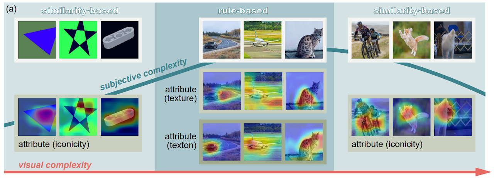

# On the Complexity of Bayesian Generalization

Code Repository for our paper **On the Complexity of Bayesian Generalization (ICML'23)**.

by [Yu-Zhe Shi](https://yuzheshi.github.io/)<sup> *</sup>, [Manjie Xu](https://mjtsu.github.io/)<sup> *</sup>, John E. Hopcroft, Kun He, Joshua B. Tenenbaum, Song-Chun Zhu, Ying Nian Wu, Wenjuan Han, [Yixin Zhu](https://yzhu.io/)

<p align="center">
    <a href='https://arxiv.org/pdf/2211.11033.pdf'>
      
    </a>
    </a>
    <a href='https://sites.google.com/view/bayesian-generalization/home'>
      
    </a>
</p>

We consider concept generalization at a large scale in the diverse and natural visual spectrum. Established computational modes (i.e., rule-based or similarity-based) are primarily studied isolated and focus on confined and abstract problem spaces. In this work, we study these two modes when the problem space scales up, and the *complexity* of concepts becomes diverse. 

Specifically, at the *representational level*, we seek to answer how the complexity varies when a visual concept is mapped to the representation space. Prior psychology literature has shown that two types of complexities (i.e., subjective complexity and visual complexity)  (Griffiths and Tenenbaum, 2003)  build an inverted-U relation (Donderi, 2006; Sun and Firestone, 2021). Leveraging Representativeness of Attribute (RoA), we computationally confirm the following observation: Models use attributes with high RoA to describe visual concepts, and the description length falls in an inverted-U relation with the increment in visual complexity. 

At the *computational level*, we aim to answer how the complexity of representation affects the shift between the rule- and similarity-based generalization. We hypothesize that category-conditioned visual modeling estimates the co-occurrence frequency between visual and categorical attributes, thus potentially serving as the prior for the natural visual world. Experimental results show that representations with relatively high subjective complexity outperform those with relatively low subjective complexity in the rule-based generalization, while the trend is the opposite in the similarity-based generalization.



This repo includes the code for the experiments.

## Dependencies

Run the following instruction in a conda environment to build the dependencies:

```
conda install requirement.yaml
```

## Data
Six datasets with the supervision of concept labels are used: LEGO, 2D-Geometric, ACRE, AwA, Places, and ImageNet, ordered as the
increment of concept-wise visual complexity. Download them and put them in the `data` folder as follows. You can refer to the `dataloader.py` to costumize your own dataset and dataloader.


```bash
Bayesian Generalization
+-- data
|  +-- 2dgeometric
|  |  +-- star
|  |  +-- ...
|  +-- lego
|  |  +-- 6632 Technic Lever 3M
|  |  +-- ...
|  +-- ACRE
|  |  +-- SmoothCylinder_Rubber_blue
|  |  +-- ...
|  +-- AwA2
|  |  +-- chihuahua
|  |  +-- ...
|  +-- Places365
|  |  +-- airfield
|  |  +-- ...
|  +-- Imagenet1k
|  |  +-- n01440764
|  |  +-- ...
```
The `acre` dataset we used in our paper is adopted from the famous [CLEVR](https://cs.stanford.edu/people/jcjohns/clevr/) and [ACRE](http://wellyzhang.github.io/project/acre.html#dataset) dataset. You can render the dataset with single object in one panel and without the blicket machine according to the ACRE repo. You can also download this dataset from our google drive [here](https://drive.google.com/file/d/1eDHvCIkAAVkPHq9y1qCPEFXggGqq7C_C/view?usp=sharing).

## Training
Using `classifier.py` to train the model:
```
python classifier.py 
-a --arch: your model backbone
-d --data: path to datasets
-e: evaluate or not, store true                                  
--dataset: path to datasets, "all" for all datasets 
--epochs: training epochs
--lr: learning rate
--gpu: device id
--resume: resume from checkpoint
...
# see more parameters in classifier.py
```
You can either train from scratch or resume from a pre-trained checkpoint. After training, save the model in the `checkpoint` folder as follows:
```
+-- ckpt
|  +-- model_best_{arch}_{dataset}.pth.tar
```
We also provide a version of pre-trained checkpoints on the datasets mentioned in the paper. You can download them from our google drive [here](https://drive.google.com/file/d/1eCuFqBYN8kuiAmoVtXWedXW0r0TdY55W/view?usp=sharing). However, we do suggest you train or finetune these models on your local dataset. As mentioned in the paper, the training samples of these models are limited to ensure the balance between different datasets.

## Hypothesis Space
See `attribute_representativeness.py` for calculating and obtaining statistics about the attribute representativeness matrix.  

See `viz_matrix.py` for visualizing all matrices. 

## Raw Entropy Analysis
This directory works for calculating raw image entropy of datasets.

To integrate the concept-wise API into your datasets, see `concept_entropy.py`.
```
python concept_entropy.py --path [DATADIR] --dataset [DATASET] --save [SAVEPATH] 
```

To visualize concept-wise entropy across datasets, see `vis_all_entropy.py`. Run `python run_vis.py` directly to visualize all datasets.
```
python run_vis.py --path [DATADIR] --dataset [DATASET] --save [false/SAVE.png] 
```

To visualize the regression target of entropy across datasets, see `vis_regression.py`.

To reshape datasets, see `sel_data.py`.

## subjective_complexity
This directory works for calculating subjective complexity of datasets.
```
# calculate the top k subjective complexity of datasets
python cal_k_cplx.py 

# visualize some of the results
python viz_k_acc.py
python viz_k_cplx.py
```

## Citation

If you find this work is helpful, please cite us as

```
@InProceedings{shi2023complexity,
  title = {On the Complexity of {B}ayesian Generalization},
  author = {Shi, Yu-Zhe and Xu, Manjie and Hopcroft, John E. and He, Kun and Tenenbaum, Joshua B. and Zhu, Song-Chun and Wu, Ying Nian and Han, Wenjuan and Zhu, Yixin},
  booktitle = {Proceedings of the 40th International Conference on Machine Learning},
  pages = {31389--31407},
  year = {2023},
  volume = {202},
  series = {Proceedings of Machine Learning Research},
  publisher =  {PMLR}
}
```

## Contact

If you have any questions about this work, feel free to contact us.
